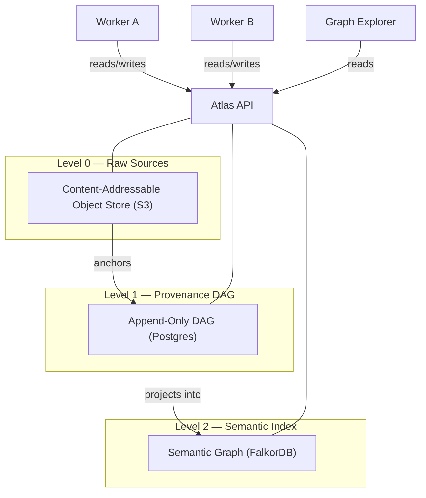

# Atlas: A Provenance Database for LLM Context Management

## Abstract

We present Atlas, a domain-specific database architecture for knowledge systems in which provenance is not metadata but the foundational data structure. Atlas inverts the conventional relationship between knowledge graphs and provenance: rather than attaching provenance information to an existing knowledge graph, the provenance DAG *is* the primary representation, and the semantic knowledge graph is a materialized view projected from it. The architecture comprises three storage levels — an immutable content-addressable object store for raw source artifacts, an append-only directed acyclic graph for derivation history, and a semantic graph index optimized for associative retrieval — unified behind a single API. All data, including metadata, classifications, and provenance itself, is treated as knowledge: queryable, derivable, and subject to the same immutability guarantees. We argue that this architecture is uniquely suited to the emerging regime of large-context-window language models, where accumulation of full inferential history provides a strategic advantage over systems that destructively consolidate.

The system is delivered as two components: **Atlas DB**, a self-contained server (Docker Compose stack) exposing the complete data model through a REST API, and **Atlas Explorer**, a bundled visual interface for navigating provenance chains and the semantic graph. Together they constitute a complete, deployable provenance database with an integrated research tool.

## 1. Introduction

Knowledge management systems face a fundamental tension: they must serve both *current* truth and *historical* understanding. Traditional knowledge graphs optimize for the former — they store what is believed to be true now, updated in place as understanding changes. This design made sense in an era of expensive storage and limited query capacity. It makes less sense in an era of large language models, where the ability to present a model with the full derivation history of a belief — including contradictions, revisions, and competing interpretations — produces qualitatively better reasoning than presenting a single consolidated snapshot.

Existing systems that address this tension do so partially. Temporal knowledge graphs (Graphiti/Zep) preserve *when* facts were valid but perform destructive entity summary updates, losing derivation history. Versioned knowledge bases (TerminusDB) track *what* changed across snapshots but not *why* or *how* knowledge was derived. Immutable databases (Datomic, Fluree) preserve all historical states but lack a semantic knowledge layer and do not model derivation chains. No existing system treats the full chain of provenance — from raw source artifact through extraction, normalization, and synthesis — as first-class, queryable knowledge.

Atlas addresses this gap through a structural inversion: the provenance DAG is the system, and everything else — including the semantic knowledge graph — is a view derived from it. This paper describes the architecture, its invariants, and its properties.

> **TODO — Reading for §1 (gap framing and motivation):**
>
> *Sources: `research/read.pdf` (PDF1, state-of-the-art map) and `research/read_2.pdf` (PDF2, provenance DAG gap analysis).*
>
> - **Talisman, J. (Feb 2026). "Where Provenance Ends, Knowledge Decays."** Substack. Traces provenance from 1841 *respect des fonds* through Semantic Web to LLMs. Key quote: *"LLMs strip provenance from knowledge — systematically, architecturally, and by design."* Notes RAG addresses retrieval-level provenance while *"leaving the deeper layer entirely unattributed."* Closest existing articulation of Atlas's motivation but proposes no technical design. `read_2.pdf`. **Priority: H — lift framing.**
> - **Takan, S. (2023). PeerJ Computer Science.** Already cited in §6. Direct quote: *"although the issue of immutability in data structures has been frequently studied, there is no research on immutability in knowledge graphs."* `read_2.pdf`. **Priority: H — put this quote in the intro.**
> - **Dibowski, H. (FOIS 2024, Bosch Research).** *"A problem that has not yet adequately been solved for KGs is the traceability and provenance of changes… KGs typically contain the current snapshot of data valid at a certain moment in time only."* `read_2.pdf`. **Priority: M.**
> - **Sikos & Seneviratne (2020). Data Science and Engineering.** Already cited. Survey finding: *RDF "inherently lacks the mechanism to attach provenance data"* — reviews named graphs, reification, RDF-star, singleton properties, nanopubs, finds none fully satisfactory. `read_2.pdf`. **Priority: H — this is the cited survey that justifies the whole RDF-workaround critique.**
> - **Figay, N. (2025). "When Knowledge Graphs Fail, It's Not the Ontology — It's the Epistemology"** (Medium). Enterprise KGs fail because teams conflate data / information / facts / inferences / unknowns — exactly the conflation Atlas's three layers separate. `read.pdf`. **Priority: M.**
> - *PDF2 core claim:* the gap has been identified from at least five independent angles (KG engineering, LLM/AI provenance, scientific reproducibility, enterprise AI governance, content addressability for AI) — none proposing the integrated solution. Use this multi-angle framing in §1. **Priority: H.**

## 2. Architecture

Atlas is organized into three storage levels. Each level serves a distinct function, but they are not independent layers in a traditional stack — Level 1 carries Level 2, and Level 0 anchors Level 1. The three levels are implementation details behind a single API; external consumers interact with Atlas exclusively through this API.

> **TODO — Reading for §2 (three-layer architecture precedents):**
>
> - **Enterprise Knowledge consultancy (2024-2025). "Graph Analytics in the Semantic Layer: An Architectural Framework for Knowledge Intelligence."** Documents a "three-graph architecture": metadata graphs (lineage, ownership) / knowledge graphs (ontology-backed entities) / analytics graphs (pattern detection). *Key distinction: operates three graph types in parallel, whereas Atlas arranges three layers sequentially.* `read.pdf`. **Priority: M.**
> - **IntuitionLabs (2025) biotech/pharma KG pattern.** Data lake → semantic integration (graph DB) → service layer. Closer to Atlas's sequential flow. `read.pdf`. **Priority: L.**
> - **Ant Group OpenSPG/KGFabric (VLDB 2024).** Industrial-scale integration of property graph performance with semantic constraints; **98% storage reduction vs Neo4j** via hybrid compression. `read.pdf`. **Priority: L — cite for scale validation.**
> - **SPADE (SRI International).** Provenance auditing system storing derivation chains in Neo4j OR Postgres, abstracting over both through its QuickGrail query language (ACM Queue 3476885). *The closest direct analog to Atlas's split-store architecture (FalkorDB for semantics, Postgres for provenance).* `read.pdf`. **Priority: H — must cite in §6, currently missing.**
> - **dbt Semantic Layer, Cube.dev, AtScale.** Analytics semantic layer tradition — abstraction over warehouse data into business metrics. January 2026 **Open Semantic Interchange (OSI)** spec supported by 40+ companies (Snowflake, Salesforce, Databricks). Shares DNA with transformation lineage but at dataset level, not per-fact. `read.pdf`. **Priority: L.**

### 2.1 Level 0: Raw Sources (Quellen)

Level 0 is an immutable, content-addressable object store. Every external artifact ingested into Atlas — a document, an email, a chat transcript, an image — is stored as a Record: a raw, unmodified copy of the original, addressed by its SHA-256 content hash. Records are self-describing through attached metadata sufficient to reconstruct the full database state from Level 0 alone.

Level 0 is the only level that contains ground truth in the absolute sense. It is the archive — the fixpoint against which all derived knowledge can be validated.

**Invariants:**
- Records are immutable. Once written, a Record is never modified or deleted.
- Records are content-addressed. The SHA-256 hash serves as the canonical identifier.
- Records are self-describing. Metadata is sufficient for full reconstruction.

### 2.2 Level 1: Provenance DAG (Provenienz)

Level 1 is an append-only directed acyclic graph stored in Postgres. Its nodes are Thoughts — knowledge products derived from Records or other Thoughts through processing by external tools (workers). Every Thought requires at least one input (a Record or another Thought) and one tool attribution. The graph is strictly acyclic because derivations cannot be circular: a Thought cannot be derived from its own output.

Level 1 is the core of Atlas. It stores the complete history of how knowledge was produced — not just what is believed, but *how it came to be believed*. This history is itself knowledge: queryable, traversable, and available as context for downstream consumers.

Provenance edges carry metadata: which tool produced the derivation, its configuration, the model version (if an LLM), and timestamps. This metadata is not auxiliary — it is part of the knowledge graph. A derivation produced by a 2024 language model and one produced by a 2028 model from the same source Record are both preserved as competing interpretations with full provenance.

**Invariants:**
- The graph is append-only. Thoughts are never modified or deleted.
- The graph is acyclic. No Thought can transitively depend on itself.
- Every Thought has provenance. No node exists without at least one input edge and one tool attribution.

### 2.3 Level 2: Semantic Index (Semantik)

Level 2 is a semantic graph stored in FalkorDB, optimized for associative traversal and retrieval. It is a **materialized view** projected from Level 1 — specifically, a filtered subset of DAG nodes (entities, facts, relations) represented as a property graph with semantic edges.

Every node and every edge in Level 2 has a provenance reference back into the Level 1 DAG. Level 2 contains no independent truth — it is entirely derived from and traceable to Level 1.

Relations in Level 2 are natural-language labels, not formal ontology predicates. Each relation is a unique node with its own identity, temporal validity window (`valid_from`, `valid_until`), confidence score, and provenance chain. The ontology is not predefined — it emerges from the data as workers extract and normalize relations over time.

Level 2 is, strictly speaking, an index. It exists because the full Level 1 DAG is too large and too deep for efficient associative retrieval. Consumers — whether LLM agents, dashboards, or analytical tools — typically enter through Level 2 and descend into Level 1 only when provenance or derivation history is needed.

**Invariants:**
- Every node and edge in Level 2 has a provenance reference to Level 1.
- Level 2 can be fully reconstructed from Level 1.
- Relations use natural-language labels. No formal ontology is required.

## 3. Core Properties

### 3.1 Everything Is Knowledge

Atlas makes no distinction between data, metadata, and provenance. A classification ("this Record belongs to the finance domain") is a Thought with provenance. A visibility decision ("this Record is accessible to group X") is a Thought with provenance. An assessment of quality ("the 2028 extractor produces better results than the 2024 extractor") is a Thought with provenance.

This principle — *everything is knowledge* — eliminates the need for separate metadata systems, tagging taxonomies, or access control lists as external infrastructure. All of these are expressible as nodes in the DAG, derived from the same sources, subject to the same immutability guarantees, and queryable through the same API.

> **TODO — Reading for §3.1 (epistemological tradition):**
>
> *This is the intellectual lineage §3.1 is currently missing. PDF1 traces a tradition from 1979 TMSes to 2026 AI memory papers that Atlas sits squarely inside — no existing PKG has operationalized it.*
>
> - **Doyle, J. (1979). "A Truth Maintenance System."** *Artificial Intelligence.* JTMS — dependency network of beliefs and justifications; traces conclusions to premises; propagates revision through the network. **Atlas's direct intellectual ancestor.** `read.pdf`. **Priority: H.**
> - **de Kleer, J. (1986). "An Assumption-Based TMS."** ATMS extends JTMS to maintain all alternative assumption sets simultaneously — conceptually parallel to Atlas's add-only preservation of multiple states of belief. `read.pdf`. **Priority: H.**
> - **Alchourrón, Gärdenfors & Makinson (1985). AGM framework.** Formal postulates for rational belief change (expansion, revision, contraction). See SEP entry `plato.stanford.edu/entries/logic-belief-revision/`. `read.pdf`. **Priority: M.**
> - **"Graph-Native Cognitive Memory for AI Agents: Formal Belief Revision Semantics for Versioned Memory Architectures"** (2025-2026, arXiv 2603.17244). Applies AGM postulates to a Neo4j-based memory architecture for AI agents — proves graph memory operations can satisfy formal belief revision axioms. **Closest published work to Atlas's epistemological framing**, targets AI agent memory rather than personal cognition. `read.pdf`. **Priority: H.**
> - **Carneades argumentation framework.** Varying proof standards per statement — direct analog to per-entity conviction levels. `read.pdf`. **Priority: L.**
> - **ASPIC+ framework.** Strict vs defeasible inference with three attack types (undermining premises, rebutting conclusions, undercutting rule applicability). `read.pdf`. **Priority: L.**
> - **AKReF (2025, arXiv 2506.00713).** Constructs argumentation knowledge graphs from text using ASPIC+. Heterogeneous graphs with argument nodes and attack/support edges. `read.pdf`. **Priority: L.**
> - *PDF1 observation:* the phrase *"thoughts as provenance"* — where synthesized knowledge generates semantic edges whose provenance the thought becomes — **appears genuinely unique**. No other system explicitly frames the act of thinking as evidence generation. Make this explicit in §3.1. **Priority: H.**

### 3.2 Immutability and Accumulation

Atlas is strictly append-only at the knowledge level. No Record, Thought, or semantic relation is ever modified or deleted through normal operation. When new information contradicts existing knowledge, the contradiction is represented as a new Thought — not as an update to the old one. Both coexist in the graph, each with full provenance.

This design is a deliberate bet on the trajectory of language model context windows. Systems that destructively consolidate today — merging entity summaries, deduplicating facts, compacting histories — optimize for current retrieval efficiency at the cost of inferential depth. Atlas optimizes for a future in which a model receiving the full derivation history of a belief (including contradictions and revisions) produces better reasoning than one receiving a consolidated summary.

Immutability applies to knowledge, not to infrastructure. Technical defects (e.g., a buggy worker producing a million duplicate entries) are addressable through administrative purge operations that act on the storage level outside Atlas's data model, identified by worker run IDs. These operations are logged but are not part of the knowledge graph — they are infrastructure maintenance, not epistemological events.

> **TODO — Reading for §3.2 (immutability as foundational principle):**
>
> - **Helland, P. (2015). "Immutability Changes Everything."** *CIDR 2015.* Already in references. Key quotes to lift: *"accountants don't use erasers"* and *"the truth is the log; the database is a cache of a subset of the log."* **PDF2 explicitly notes: "No subsequent work has explicitly applied Helland's thesis to knowledge graphs, despite its enormous influence on event sourcing and distributed systems."** Atlas would be the first. `read_2.pdf`. **Priority: H.**
> - **Nelson, T. (1960-present). Project Xanadu.** Specified immutable, add-only content space where documents are lists of pointers to regions in an "ever-growing" store; transclusion maintains *"visible provenance to the source"*; every connection bidirectional. **PDF2: "arguably the direct ancestor of what Atlas proposes."** Cautionary lesson: Xanadu's refusal to compromise prevented adoption while the simpler Web prevailed. `read_2.pdf`. **Priority: H — currently missing from §6, must add.**
> - **Hickey, R. (2012). Datomic.** Already cited. PDF2 nuance to add: Datomic captures the *temporal* dimension of knowledge (what changed, when) but **not the *epistemic* dimension** (how knowledge was derived, from what evidence, by what process). `read_2.pdf`. **Priority: M.**
> - **Records in Contexts (RiC-O v1.1, May 2025, ICA).** International Council on Archives standard. Describes archival world as *"a graph of interconnected things"*; models `rico:ProvenanceRelation` as first-class OWL relation type. Archival profession's 180-year-old *respect des fonds* principle rendered as a knowledge graph standard — a conceptual ancestor of Atlas from a completely different intellectual tradition. `read_2.pdf`. **Priority: M — adds archival-theory legitimacy, currently missing.**
> - **Google Always-On Memory Agent (March 2026, open-source).** The explicit opposite of Atlas. ConsolidateAgent runs every 30 minutes, merging duplicates and dropping information to *"mimic how the human brain processes information during sleep."* No vector DB, no embeddings — the LLM reads, thinks, and writes structured memory into SQLite, making the **LLM the truth arbiter**. Atlas's motto inversion: *"the graph is the truth, the LLM translates."* `read.pdf`. **Priority: H — cite explicitly as anti-Atlas in §7.1 contrast.**
> - **XTDB (formerly CruxDB).** Append-only log with native bitemporal support. Rare precedent for add-only temporal database. `read.pdf`. **Priority: L.**
> - **DefraDB / Arweave.** Content-addressable distributed storage with immutability guarantees — check how they handle provenance. `read_2.pdf`. **Priority: L.**

### 3.3 The Provenance DAG as Substrate

In conventional systems, the knowledge graph is primary and provenance is attached to it as secondary metadata. Atlas inverts this relationship: the provenance DAG (Level 1) is the foundational structure, and the semantic knowledge graph (Level 2) is a projection from it.

This inversion has a concrete architectural consequence: operations that would require complex graph surgery in a conventional system become simple view operations in Atlas. Reprocessing sources with better tools produces new Thoughts alongside old ones — no migration required. Filtering out results from an obsolete worker is a query parameter, not a data operation. Evaluating competing interpretations of the same source is a traversal of the DAG, not a diff between snapshots.

> **TODO — Reading for §3.3 (the architectural inversion — the core novelty claim):**
>
> ***Read PDF2 in full before rewriting this section.*** PDF2 is entirely dedicated to documenting this inversion as the genuine research gap. Its opening claim is the spine of this paper:
>
> > *"No existing system — academic or production — fully implements an architecture where an immutable, append-only provenance DAG serves as the primary data structure for a knowledge system. This represents a real and well-documented research gap, not a solved problem repackaged."*
>
> And the core framing:
>
> > *"In every existing system surveyed, the knowledge graph is primary and provenance is secondary metadata attached to it. Atlas proposes the reverse."*
>
> **Sources relevant to §3.3:**
>
> - **RDF-star (being standardized as RDF 1.2).** Embedded triples: `<<:bob :knows :alice>> :source :wikipedia`. ~50% data volume reduction vs classical reification (Ontotext benchmarks, GraphDB 11.2 docs). *Still an annotation mechanism, not a derivation chain system — sharpen this contrast.* `read.pdf` + `read_2.pdf`. **Priority: M.**
> - **Named graphs (Carroll et al. 2005, ACM 1060745.1060835).** Foundational RDF provenance mechanism. W3C Provenance WG (2011) explicitly documented the granularity mismatch: named graphs operate at document level, triple-level requires verbose singleton graphs, derived triples have no natural provenance "home." `read.pdf`. **Priority: M.**
> - **Palantir Foundry.** Tracks complete dataset-level lineage from raw ingestion through all transformations with interactive DAG visualization. **Dataset-level, not fact-level** — sharpen the contrast. `read.pdf`. **Priority: L.**
> - **Google Knowledge Vault (2014) / NELL (CMU).** Per-fact confidence and extraction source tracking, but no complete transformation lineage. `read.pdf`. **Priority: L.**
> - **UaG — Uncertainty-Aware Graph (CIKM 2024).** Conformal prediction in KG-LLM reasoning; uses uncertainty to **guide** reasoning paths. *PDF1: "the closest academic work to Atlas's provenance as query direction."* `read.pdf`. **Priority: M — elevates §3.3's "provenance guides query behavior" claim beyond mere filtering.**
> - **Dagstuhl survey (2024) on uncertainty in KG construction.** Documents how confidence scores propagate through construction pipelines. Facebook's KG removes facts below confidence thresholds. Treats provenance as a filter, not as substrate — sharpen distinction. `read.pdf`. **Priority: L.**

### 3.4 Visibility as a Derived Property

Access control in Atlas is not a system feature but an application-level concern expressible within the data model. Every input artifact has an owner — not a person but a user group. Groups are hierarchically organized. A node in the DAG is visible to a user if and only if all of its inputs are visible to that user. At the root (Level 0), this means ownership by one of the user's groups.

Visibility propagates through the provenance graph: a Thought derived from one public and one confidential Record is automatically confidential. Changing visibility at a source Record propagates immediately through all derived Thoughts — not through explicit re-tagging but through DAG traversal. This is compliance by architecture, not by policy.

The classification of Records into visibility groups is itself a Thought with provenance — produced by a worker, subject to revision, queryable like any other knowledge.

## 4. Implementation

Atlas is delivered as two components.

### 4.1 Atlas DB

Atlas DB is a self-contained server deployed as a Docker Compose stack. It encapsulates the three storage engines (S3-compatible object store, Postgres, FalkorDB) behind a single REST API. The storage engines are hidden implementation details — consumers interact exclusively with the API, which enforces all invariants: immutability, acyclicity of the provenance DAG, mandatory provenance on every Thought, and content-addressability of Records.

The API is the sole interface to the system. There is no query language in the traditional sense — the API *is* the query language, imperative rather than declarative. All operations — ingesting Records, creating Thoughts, traversing provenance chains, querying the semantic graph — are API calls. Workers, the Explorer, and any future application consume the same interface.

### 4.2 Atlas Explorer

Atlas Explorer is a bundled visual interface for navigating and inspecting the Atlas data model. It is the first and reference application built against the Atlas API, shipped alongside Atlas DB but architecturally separate — it reads from the API like any other consumer.

The Explorer serves three purposes:

- **Provenance inspection.** Given any node in the semantic graph (Level 2), the Explorer traces its full derivation chain through the DAG (Level 1) down to the source artifacts (Level 0). This makes the "everything is knowledge" principle tangible: a user can follow any fact back to the raw source that produced it, through every intermediate processing step.
- **Graph exploration.** The semantic graph can be navigated visually — entities, relations, temporal validity, confidence scores. This provides the primary human interface to Atlas's knowledge state, since Level 2 is optimized for exactly this kind of associative traversal.
- **Architecture validation.** The Explorer demonstrates that the API is sufficient to support rich interactive applications. If the Explorer can render full provenance chains, temporal graphs, and cross-level traversals, then so can any downstream application — agent systems, dashboards, or export tools.

The Explorer is not part of Atlas's core architecture. It is an application. But it is bundled because a database without a way to see its contents is not usable as a research tool — and Atlas, in its current phase, is primarily a research tool.

## 5. Workers

Atlas is a database. It does not contain application logic, AI models, or processing pipelines. External processes — **workers** — interact with Atlas exclusively through the API, reading existing Records and Thoughts and writing new Thoughts.

Workers may be LLM-based (entity extraction, summarization, synthesis), deterministic (format conversion, deduplication detection), or hybrid. Atlas is agnostic to the nature of its workers — it tracks only the provenance of their outputs: what inputs they consumed, which tool and configuration they used, and when they ran. Workers are identified by run IDs, enabling administrative operations (such as purging defective runs) without affecting the knowledge model.

The same Record can be processed by multiple workers or by successive versions of the same worker. Old and new results coexist with full provenance. Consumers select between them through view configuration (e.g., preferring the most recent extractor), not through data operations.

The design, implementation, and evaluation of a concrete worker pipeline — from raw data ingestion through normalization, summarization, and entity extraction to a populated semantic graph — is the subject of a companion paper.

## 6. Related Work

> **TODO — §6 is currently under-cited relative to PDF1 (8 research areas) and PDF2 (5 closest systems + 5-angle gap). New subsections to add: Quit Store, Blue Brain Nexus, SPADE, Fluree detail, Xanadu, Helland, RiC-O, PROV-AGENT, Bitemporal KGs (AeonG/BiTRDF), Personal Knowledge Graph community (Balog/Stavanger), JTMS/ATMS/AGM, Senzing, Tools-for-Thought lineage. See per-subsection TODOs below.**

### 6.1 Temporal Knowledge Graphs: Graphiti/Zep

Graphiti (Zep, 2024–2025) is the closest existing system to Atlas in the LLM context management space. It builds temporal, provenance-aware knowledge graphs using FalkorDB or Neo4j, with bidirectional episode indices and temporal validity windows. Facts are invalidated rather than deleted.

However, Graphiti performs destructive entity summary updates, lacks a separate content-addressable source archive (Level 0), embeds provenance in the knowledge graph rather than maintaining a separate provenance DAG, and does not treat provenance as queryable knowledge. Atlas can be understood as an extension of Graphiti's philosophy — adding immutability, a source archive, and the architectural inversion that makes provenance the substrate rather than an annotation.

> **TODO — Reading for §6.1 (Graphiti/Zep expansion):**
>
> - **"Graphiti: Knowledge Graph Memory for AI Agents"** (Rasmussen et al., arXiv 2501.13956, January 2025). **Read in full before finalizing §6.1.** `read_2.pdf`. **Priority: H.**
> - `read.pdf` and `read_2.pdf` detail to add:
>   - **94.8% on the DMR benchmark**, P95 retrieval latency **300ms**.
>   - Three-layer architecture paralleling Atlas: episodic subgraph (raw events) / semantic subgraph (extracted facts) / community subgraph.
>   - Uses the **same graph databases Atlas specifies** (Neo4j OR FalkorDB).
>   - Bi-temporal `t_valid`/`t_invalid` fields; old facts *"invalidated, not deleted."*
>   - **55-60% architectural overlap** with Atlas (PDF2 estimate).
>   - *Key differentiator:* Graphiti performs **destructive entity summary updates** (arXiv 2501.13956 explicit). This is the precise distinction Atlas maintains.
>   - Graphiti's **"non-lossy" design philosophy** is PDF2's identified "closest articulation" of Atlas's accumulation bet — but Graphiti still consolidates at entity level.
> - **Priority: H — Graphiti is the single most important comparison in the paper.**

### 6.2 Versioned Knowledge Bases: TerminusDB

TerminusDB provides Git-like versioning (branch, merge, time-travel) over an RDF knowledge graph using append-only delta encoding. It captures *what* changed across versions but not *why* — there is no derivation chain, no source archive, and no concept of workers as provenance-tracked processors. Its foundational structure is a versioned graph, not a provenance DAG.

> **TODO — Reading for §6.2 (TerminusDB expansion):**
>
> - **Mendel-Gleason et al. TerminusDB technical paper.** Already in references. Read before finalizing §6.2.
> - `read_2.pdf` detail to add:
>   - Origin: Trinity College Dublin, Horizon 2020 ALIGNED project (owlapps 62518551).
>   - Uses append-only **succinct data structures with delta encoding**.
>   - Every transaction creates a new immutable layer.
>   - **~75-80% architectural overlap with Atlas — highest of all surveyed systems.**
>   - Missing: no content-addressable blob store for raw artifacts; no concept of transformation workers or AI processors as first-class participants; foundational structure is a *versioned RDF graph*, not a provenance DAG; tracks *what* changed but not *why or how knowledge was derived*.
> - **Priority: H.**

### 6.3 Immutable Databases: Datomic and Fluree

Datomic (Hickey, 2012) operationalizes Pat Helland's "Immutability Changes Everything" thesis as an append-only database of immutable datoms. Fluree combines an append-only ledger with a semantic graph database. Both capture temporal history but not epistemic history — they record *when* facts changed but not *how knowledge was derived from sources through processing chains*.

> **TODO — Reading for §6.3 (Datomic/Fluree expansion + Helland):**
>
> - **Helland, P. (2015). "Immutability Changes Everything."** CIDR 2015. `cidrdb.org/cidr2015/Papers/CIDR15_Paper16.pdf` + ACM Queue 2884038. **Read in full — this is the theoretical foundation of Atlas's §3.2.** Core quotes: *"accountants don't use erasers"*, *"the truth is the log; the database is a cache of a subset of the log."* **PDF2 explicitly: "No subsequent work has explicitly applied Helland's thesis to knowledge graphs, despite its enormous influence."** Atlas is the first. `read_2.pdf`. **Priority: H.**
> - **Nubank case study.** Engineers applied Datomic to microservice dependency graphs and used the phrase *"immutable knowledge databases"* — closest vernacular antecedent for Atlas's framing. `read_2.pdf`. **Priority: L.**
> - `read_2.pdf` Fluree detail: founded 2017, supports RDF + JSON-LD + SPARQL + SHACL validation. Every update cryptographically chained, enabling time-travel and verifiable data history. **PDF2: "perhaps the closest *production database* to the Atlas vision."** But Fluree's immutability operates at the transactional ledger level, not at the level of a provenance DAG tracking derivation chains. No separate content-addressable blob store. AI/ML processors not modeled as first-class graph participants. **Priority: M.**
> - Datomic nuance from PDF2: captures the *temporal* dimension (what changed, when) but **not the *epistemic* dimension** (how knowledge was derived, from what evidence, by what process). This is the distinction Atlas introduces. **Priority: M.**

### 6.4 W3C PROV-DM

The W3C PROV Data Model provides a formal vocabulary for provenance (Entity, Activity, Agent, wasGeneratedBy, wasDerivedFrom, used). Atlas's internal model is semantically compatible with PROV-DM — Records map to Entities, worker runs to Activities, tools to Agents — but Atlas does not depend on or implement the W3C stack (RDF, SPARQL, OWL). PROV-DM compatibility exists at the conceptual level, enabling potential export or interoperability without architectural coupling.

> **TODO — Reading for §6.4 (PROV-DM expansion):**
>
> - **Sikos & Seneviratne (2020). "Provenance-Aware Knowledge Representation: A Survey of Data Models and Contextualized Knowledge Graphs."** *Data Science and Engineering.* **Already in references. Read in full — this is the canonical survey of every RDF-provenance workaround.** Key finding: *RDF "inherently lacks the mechanism to attach provenance data"* — reviews named graphs, reification, RDF-star, singleton properties, nanopublications, finds none fully satisfactory. `read_2.pdf`. **Priority: H.**
> - `read.pdf` PROV-O adoption data: **OpenCitations tracks over 2 billion citations using PROV-O**; 2025 Nature Scientific Data paper aligned PROV-O with the ISO-standard Basic Formal Ontology (BFO). `read.pdf`. **Priority: M.**
> - **Carroll et al. (2005).** *"Named Graphs, Provenance and Trust"* (ACM 10.1145/1060745.1060835). Foundational paper establishing named graphs for provenance. W3C Provenance Working Group (2011) documented the granularity mismatch. `read.pdf`. **Priority: M.**
> - **RDF-star / PROV-STAR as bolt-on provenance.** PDF2 gap table: "Nanopubs are flat collections; PROV-STAR is a bolt-on." Contrast with Atlas's substrate approach. `read_2.pdf`. **Priority: M.**
> - **PROV-AGENT (Souza et al., IEEE e-Science 2025, arXiv 2508.02866).** First provenance framework for AI agent workflows; extends W3C PROV with agent-specific metadata. *Operates within traditional workflow orchestration rather than proposing a provenance-first architecture.* `read_2.pdf`. **Priority: M — currently missing from §6, must add.**

### 6.5 Nanopublications

Nanopublications (Kuhn & Dumontier, 2014) are immutable, content-addressable scholarly assertions with embedded provenance. They share Atlas's commitment to immutability and provenance-per-assertion but are a flat collection of independent assertions — they do not form a derivation DAG connecting assertions through chains of processing, and they do not support a semantic graph layer.

> **TODO — Reading for §6.5 (Nanopublications expansion):**
>
> - **Kuhn & Dumontier (2014). "Trusty URIs."** ESWC 2014. Already in references. Read for the content-addressability mechanism (cryptographic hash URIs).
> - `read_2.pdf` detail: over **10 million nanopublications** exist, primarily in life sciences. Each nanopub contains three named RDF graphs: assertion, provenance, publication info. **Priority: M.**
> - **2025 extension: "Nanopublications with Knowledge Provenance"** (International Journal of Digital Libraries, Springer s00799-025-00431-x). Extends with trust networks where multiple agents assign truth values on a 0-1 scale — *parallel to Atlas's conviction levels, though at scientific publication level rather than personal knowledge.* `read.pdf`. **Priority: M — add to references.**

### 6.6 TODO: Additional prior art (currently missing from §6, must add)

The following systems and traditions are flagged by PDF1 or PDF2 as meaningfully close to Atlas but are not currently covered. Each is a new subsection to write.

> **TODO — §6.6.1 Quit Store (AKSW Leipzig):**
>
> - SPARQL 1.1 endpoint backed entirely by Git. RDF named graphs stored as canonicalized N-Quads in Git's SHA-1 content-addressed object store. Automatic W3C PROV-O generation from commit metadata. `quit blame` for per-statement provenance.
> - **~60-65% architectural overlap with Atlas — second-closest in PDF2.**
> - Literally uses Git's Merkle DAG as storage layer for a KG with provenance.
> - Missing: only structured RDF (not raw artifacts like PDFs); academic prototype with performance limitations; provenance derived from version control metadata, not an explicit derivation DAG.
> - Reference: ScienceDirect S1570826818300416; CEUR-WS Vol-1824 mepdaw_paper_2.pdf. `read_2.pdf`. **Priority: H.**

> **TODO — §6.6.2 Blue Brain Nexus (EPFL):**
>
> - Open-source neuroscience data management platform. Semantic Web Journal 2023. W3C PROV as provenance backbone, SHACL validation, event-sourced streaming architecture. Explicitly treats *"provenance as a first-class citizen."*
> - PDF2: *"deserves special mention as the closest working knowledge platform with provenance aspirations. Even here, the knowledge graph is primary and provenance enriches it — the architectural inversion remains unmade."*
> - Reference: ResearchGate 330751750. `read_2.pdf`. **Priority: M.**

> **TODO — §6.6.3 SPADE (SRI International):**
>
> - Provenance auditing system storing derivation chains in Neo4j OR Postgres, abstracting over both through its QuickGrail query language.
> - **Only existing system with split-store architecture analogous to Atlas's FalkorDB + Postgres.**
> - Reference: ACM Queue 3476885. `read.pdf`. **Priority: H — currently missing.**

> **TODO — §6.6.4 Project Xanadu (Nelson, 1960-present):**
>
> - Specified immutable, add-only content space; documents as lists of pointers to regions in an ever-growing store; transclusion maintains visible provenance to source; bidirectional connections.
> - **PDF2: "arguably the direct ancestor of what Atlas proposes — append-only content-addressable storage with provenance as the organizing principle."**
> - Cautionary lesson: Xanadu's refusal to compromise on its complete vision prevented adoption while the simpler WWW prevailed.
> - References: Grokipedia entry on Project Xanadu; WebProNews coverage. `read_2.pdf`. **Priority: H — currently missing.**

> **TODO — §6.6.5 Records in Contexts (RiC-O v1.1, May 2025, ICA):**
>
> - International Council on Archives standard. Describes archival world as *"a graph of interconnected things."*
> - Models `rico:ProvenanceRelation` as first-class OWL relation type for linked data.
> - Archival profession's **180-year-old *respect des fonds* principle** rendered as a knowledge graph standard.
> - Intellectual ancestor from an entirely different tradition than CS. `read_2.pdf`. **Priority: M.**

> **TODO — §6.6.6 Bitemporal Knowledge Graphs: AeonG, BiTRDF, XTDB, OSTRICH:**
>
> - **Chekol et al. (2018)** explicitly identified the bitemporal KG gap: Wikidata uses only valid time, NELL uses only transaction time (ACM 3184558.3191637).
> - **AeonG (Anselma et al., ADBIS 2025).** Extends property graphs with explicit bitemporal timestamps on every element — **9.74% performance overhead** (Università di Torino). Reference: Springer 978-3-032-05281-0_15. **Priority: M.**
> - **BiTRDF (MDPI Mathematics 2025).** Adds both temporal dimensions to RDF. Reference: MDPI 2227-7390/13/13/2109. **Priority: M.**
> - **XTDB (formerly CruxDB).** Append-only log with native bitemporal support — precedent in temporal databases, rare in KG systems. **Priority: L.**
> - **OSTRICH (Taelman et al., Journal of Web Semantics 2018).** Versioned RDF triple store with append-only delta ingestion, three query types across versions (ScienceDirect S1570826818300404). **Priority: L.**
> - **Key framing for Atlas §6.6.6:** Atlas achieves **emergent bitemporality through architectural composition** (valid time on L2 edges, transaction time via L1 DAG) — architecturally simpler than explicit bitemporal annotations. `read.pdf`. **Priority: M — this is a distinctive selling point worth a dedicated subsection.**

> **TODO — §6.6.7 Event Sourcing as KG substrate:**
>
> - **Telicent CORE platform.** Event-driven KG using Apache Kafka as the event log backbone, with events flowing through topics into RDF format and multiple derived stores (graph, search, vector). Reference: telicent.io/news/event-driven-knowledge-graphs.
> - **TMForum "Atomic Events" model.** Append-only EAV events with timestamps for building temporal KGs.
> - **Key distinction:** event sourcing stores a *linear sequence* of events per aggregate; a provenance DAG captures a *richer graph* of derivation relationships. **No published work frames event sourcing specifically as a knowledge management pattern.** `read_2.pdf`. **Priority: L.**

> **TODO — §6.6.8 Personal Knowledge Graphs (academic community):**
>
> - **Balog, K. (University of Stavanger).** "Personal Knowledge Graphs: A Research Agenda." ICTIR 2019. Foundational paper.
> - **"An Ecosystem for Personal Knowledge Graphs"** (ScienceDirect 2024, S2666651024000044). Survey defining PKGs around data ownership by single individual and personalized service delivery.
> - **PKG API (WWW Companion 2024, ACM 3589335.3651247).** Proposes RDF-based PKG vocabulary with provenance and access rights.
> - **PDF1 observation:** PKG academic community primarily targets **recommendation and personalization** — not the **cognitive augmentation** Atlas pursues. Atlas's position is distinct from the Balog line of work. `read.pdf`. **Priority: M — framing.**

> **TODO — §6.6.9 Truth Maintenance & Belief Revision (intellectual ancestors):**
>
> - **Doyle, J. (1979). JTMS.** *Artificial Intelligence.* Dependency network for beliefs and justifications. **Direct ancestor of Atlas's provenance model.** `read.pdf`. **Priority: H.**
> - **de Kleer, J. (1986). ATMS.** Maintains all alternative assumption sets simultaneously. **Closest to Atlas's add-only preservation of competing beliefs.** `read.pdf`. **Priority: H.**
> - **AGM (1985).** Formal postulates for belief change. JSTOR 41487515. `read.pdf`. **Priority: M.**
> - **"Graph-Native Cognitive Memory for AI Agents"** (arXiv 2603.17244, 2025-2026). Applies AGM to Neo4j AI memory. **Closest published work to Atlas epistemology.** `read.pdf`. **Priority: H.**
> - This section would elevate Atlas's intellectual lineage beyond database systems to include 45 years of AI knowledge representation work.

### 6.7 The Identified Gap

No existing system combines: (a) a content-addressable immutable source archive, (b) an append-only provenance DAG as the primary data structure, (c) a semantic knowledge graph as a materialized view with per-edge provenance, and (d) natural-language relations with emergent ontology. Each component has mature prior art; the architectural composition is novel.

> **TODO — Reading for §6.7 (rewrite with PDF2's 5-angle gap framing):**
>
> PDF2 documents the gap being identified from **five independent research angles**, none of which propose the integrated solution. Use this as the structural spine of §6.7:
>
> 1. **Knowledge graph engineering.** Sikos (2020), Takan (2023, PeerJ, *"no research on immutability in knowledge graphs"*), Dibowski (FOIS 2024). All document that provenance in KGs is fundamentally unsolved.
> 2. **LLM / AI provenance.** 2025 Frontiers in Computer Science survey on KG-LLM fusion identifies *"unclear knowledge provenance"* as a key challenge. PROV-AGENT (Souza et al. IEEE e-Science 2025) is the first provenance framework for AI agent workflows.
> 3. **Scientific reproducibility.** **72-83% of researchers acknowledge a reproducibility crisis** (SEC.gov/files/ctf-written-input-knowledge-provenance-protocol-kpp). REPRODUCE-ME ontology (2022), Knowledge Provenance Protocol (KPP 2025) — both DAG-based but domain-specific.
> 4. **Enterprise AI governance.** Amazon Bedrock AgentCore (2025) adopted append-only memory patterns marking outdated memories INVALID rather than deleting. Bolt-on solution.
> 5. **Content addressability for AI.** ISPE article (Jan 2026) advocates content-addressable storage for AI knowledge management, predicts *"AI copilots with built-in provenance: every answer cites the exact CIDs used."* Closest industry-perspective articulation.
>
> - **ICLR 2026 Workshop on Memory for LLM-Based Agentic Systems (MemAgents).** Explicitly calls for research on *"provenance-aware retrieval"* and *"structured memory access control."* **Community recognition of the open problem.** OpenReview U51WxL382H; arXiv 2603.10062. `read_2.pdf`. **Priority: H — cite as evidence that the gap is recognized in 2026 by the top ML venue.**
>
> **Priority: H — this section should become the longest in §6.**
>
> **Property-by-property novelty table (from PDF2 §5):** copy this table directly into §6.7:
>
> | Atlas Property | Closest Existing System | What's Missing |
> |---|---|---|
> | Content-addressable immutable blob store (SHA256) | IPFS/IPLD, Git, DefraDB | Not integrated with KG layers |
> | Provenance DAG as primary data structure | **Nothing** — all systems treat provenance as secondary | **The core architectural inversion** |
> | Semantic graph with per-edge provenance to DAG | Nanopubs, RDF-star + PROV-STAR | Nanopubs flat; PROV-STAR bolt-on |
> | Strictly append-only, no destructive operations | Datomic, Fluree, Arweave | Not combined with KG + provenance DAG |
> | AI/LLM as just one type of graph processor | PROV-AGENT (2025) | Tracks agent provenance within workflows, not provenance-first |
> | Three-layer architecture (blobs → DAG → semantic graph) | **No system combines all three** | **The unified architecture is novel** |

## 7. Discussion

### 7.1 The Context Window Bet

Atlas's append-only accumulation model is predicated on a specific technological trajectory: that large language model context windows will become fast and cheap enough to consume full derivation histories. If this trajectory holds, systems that destructively consolidate today will be unable to reconstruct the inferential context that Atlas preserves. If it does not hold, Atlas pays a storage and retrieval cost for history that cannot be effectively utilized.

Current trends support the bet. Context windows have grown from 4K tokens (2022) to 200K+ tokens (2025), with costs per token declining by orders of magnitude. The architectural question is not whether models *can* process full provenance chains, but when they can do so at acceptable latency and cost for interactive use.

> **TODO — Reading for §7.1 (accumulation vs destructive consolidation — map the opposition):**
>
> PDF1's LLM-driven KG construction section (§7) is **the single most useful source for this subsection**. It explicitly places Atlas at one extreme of a spectrum and Google's Always-On Memory Agent at the other.
>
> - **Google Always-On Memory Agent (March 2026, open-source).** **The anti-Atlas.** ConsolidateAgent runs every 30 minutes, explicitly merging duplicates and dropping information to *"mimic how the human brain processes information during sleep."* No vector DB, no embeddings — LLM as truth arbiter. References: digit.in/features/general/googles-new-ai-agent-remembers-everything; elephaant.com/blog/google-always-on-memory-agent-vector-db-alternative-2026. `read.pdf`. **Priority: H — cite as explicit counter-design.**
> - **Graphiti "non-lossy" design philosophy** (getzep.com 2025 report). PDF2: *"the closest articulation"* of Atlas's accumulation bet — but Graphiti still performs destructive entity summary updates. The closest ally; not quite an ally. `read_2.pdf`. **Priority: H.**
> - **Microsoft GraphRAG.** Community summaries are regenerated rather than appended, replacing old versions. Extraction not fully reproducible. Reference: microsoft.com/en-us/research/blog/graphrag-unlocking-llm-discovery-on-narrative-private-data. `read.pdf`. **Priority: M.**
> - **LightRAG (EMNLP 2025).** Entity deduplication merges identical entities with **no history preservation.** lightrag.github.io. `read.pdf`. **Priority: M.**
> - **EDC Framework (Zhang & Soh 2024).** Canonicalization phase explicitly consolidates schema components. `read.pdf`. **Priority: L.**
> - **iText2KG / ATOM (AuvaLab 2025).** Dual-time modeling preserves temporal metadata, but performs entity merging. github.com/AuvaLab/itext2kg. `read.pdf`. **Priority: M.**
> - **Collaborative Memory (arXiv 2505.18279).** Each memory fragment carries immutable provenance attributes — partial alignment with Atlas. `read.pdf`. **Priority: M.**
> - **Amazon Bedrock AgentCore (2025).** Append-only memory: marks outdated memories INVALID instead of deleting. Bolt-on solution. `aws.amazon.com/blogs/machine-learning/building-smarter-ai-agents-agentcore-long-term-memory-deep-dive`. `read_2.pdf`. **Priority: L.**
>
> *PDF1 key framing to use verbatim:* *"No existing system matches Atlas's full specification: add-only storage, content-addressable immutable raw sources, no destructive consolidation, conviction-based entity resolution instead of hard merges, and complete inferential history preservation. Atlas's commitment to immutability is more extreme than any published system."*

### 7.2 Reprocessing Without Migration

A distinctive property of Atlas's architecture is that improvements in processing tools require no data migration. When a better entity extractor becomes available in 2028, it runs over the same Level 0 Records and produces new Thoughts in Level 1. Old and new results coexist. Consumers select between them through view configuration — filtering by worker version, recency, or confidence score. The old results remain available as fallback, as training signal, or as historical context.

This property follows directly from immutability and the separation of Level 0 (sources) from Level 1 (derivations). In systems that update in place, reprocessing is a migration — destructive, irreversible, and operationally risky. In Atlas, reprocessing is an append operation.

> **TODO — Reading for §7.2 (reprocessing vs migration — GraphRAG family comparison):**
>
> The GraphRAG landscape is the cleanest contrast point for Atlas's reprocessing property.
>
> - **Edge et al. (April 2024). "From Local to Global: A Graph RAG Approach to Query-Focused Summarization."** Microsoft Research foundational GraphRAG paper. LLM entity/relation extraction + Leiden community detection + pre-built community summaries. `read.pdf`. **Priority: M.**
> - **DRIFT Search (Microsoft, October 2024).** Combines global and local retrieval with iterative refinement. Reference: microsoft.com/en-us/research/blog/introducing-drift-search. `read.pdf`. **Priority: L.**
> - **LazyGraphRAG (Microsoft, November 2024).** Reduces indexing costs to **0.1% of full GraphRAG** via NLP-based extraction instead of LLM summarization. lianpr.com/en/news/detail/3224. `read.pdf`. **Priority: L — cite as efficiency-trades-history example.**
> - The crucial pattern: **all GraphRAG variants require full reprocessing when the extractor improves.** Contrast explicitly with Atlas's append semantics.

### 7.3 Toward a CRDT-Compatible Architecture

An add-only monotonic DAG is provably a Conflict-Free Replicated Data Type (CRDT) — it can be replicated across distributed nodes and always merged into a consistent state without coordination. This property, while not exploited in the current single-node design, suggests that Atlas's architecture could natively support decentralized, coordination-free knowledge management. This connection between provenance DAGs and CRDTs appears unexplored in the literature.

> **TODO — Reading for §7.3 (CRDT connection — currently 1 paragraph, PDF2 says this may be the MOST significant unexplored implication of Atlas):**
>
> PDF2's §3 "Adjacent architectural concepts" closes with:
>
> > *"A deep and underexplored connection exists between CRDTs and provenance DAGs. Shapiro et al.'s foundational CRDT work (2011) formally proved that an add-only monotonic DAG is a CRDT. Byzantine Fault Tolerant CRDTs use Merkle-DAGs (hash graphs representing causal partial order among updates) that are structurally identical to content-addressed provenance graphs. This connection is **entirely unexploited** in the knowledge management literature — a CRDT-based provenance DAG would enable truly decentralized, coordination-free knowledge management with automatic merge, which may be the most significant unexplored implication of the Atlas architecture."*
>
> **Consider elevating §7.3 from a single paragraph to its own major section, or spin it off as a companion paper.**
>
> - **Shapiro, Preguiça, Baquero & Zawirski (2011). "Conflict-Free Replicated Data Types."** *Proceedings of the 13th International Symposium on Stabilization, Safety, and Security of Distributed Systems (SSS 2011).* Springer 978-3-642-24550-3_29. **Foundational paper. Formally proves: add-only monotonic DAG is a CRDT.** `read_2.pdf`. **Priority: H — must cite.**
> - **Byzantine Fault Tolerant CRDTs with Merkle-DAGs.** PDF2: "structurally identical to content-addressed provenance graphs." Reference: jzhao.xyz/thoughts/CRDT. `read_2.pdf`. **Priority: H.**
> - **IPFS / IPLD.** Content-addressable DAG substrate used in distributed systems — check how they handle epistemic layer (they don't, but understand the primitives). `read_2.pdf §5 table`. **Priority: M.**
> - **DefraDB.** Content-addressable immutable blob store with knowledge graph aspirations. `read_2.pdf §5 table`. **Priority: L.**
> - **Arweave.** Strictly append-only, no destructive operations, permanent storage. dolthub.com/blog/2022-03-21-immutable-database. `read_2.pdf §5 table`. **Priority: L.**

## 8. Conclusion

Atlas proposes a structural inversion in knowledge system design: provenance as substrate rather than metadata, knowledge graph as view rather than source of truth. The architecture — immutable source archive, append-only provenance DAG, semantic graph as materialized view — is a composition of individually well-understood components whose integration has not been previously proposed.

The core thesis is that knowledge graph history is not metadata — it is knowledge. By treating all provenance, all classifications, all assessments as first-class nodes in the same graph, Atlas eliminates the distinction between data and metadata, between knowledge and knowledge-about-knowledge. Everything is knowledge. Everything is graph.

The system is designed for a technological regime that does not yet fully exist — one in which language models can efficiently consume full derivation histories. This is a deliberate architectural bet, analogous to developing a 3D game engine before consumer hardware can render it in real time. Systems that accumulate inferential history today will be positioned to provide qualitatively richer context to capable models tomorrow. Systems that destructively consolidate will not be able to reconstruct what they have discarded.

## References

- Helland, P. (2015). Immutability Changes Everything. CIDR 2015.
- Hickey, R. (2012). Datomic: A Database of Flexible, Time-Based Facts.
- Kuhn, T. & Dumontier, M. (2014). Trusty URIs: Verifiable, Immutable, and Permanent Digital Artifacts for Linked Data. ESWC 2014.
- Mendel-Gleason, G. et al. TerminusDB: An Open Source Model Driven Graph Database for Knowledge Graph Representation.
- Moreau, L. & Missier, P. (2013). PROV-DM: The PROV Data Model. W3C Recommendation.
- Nelson, T. (1965). A File Structure for the Complex, the Changing, and the Indeterminate. ACM/CSC-ER.
- Rasmussen, P. (2025). Zep: A Temporal Knowledge Graph Architecture for Agent Memory.
- Sikos, L.F. & Seneviratne, O. (2020). Provenance-Aware Knowledge Representation: A Survey. Data Science and Engineering.
- Takan, S. (2023). Knowledge Graph Augmentation: Consistency, Immutability, Reliability, and Context. PeerJ Computer Science.

---

*Draft v0.1 — April 2026*
