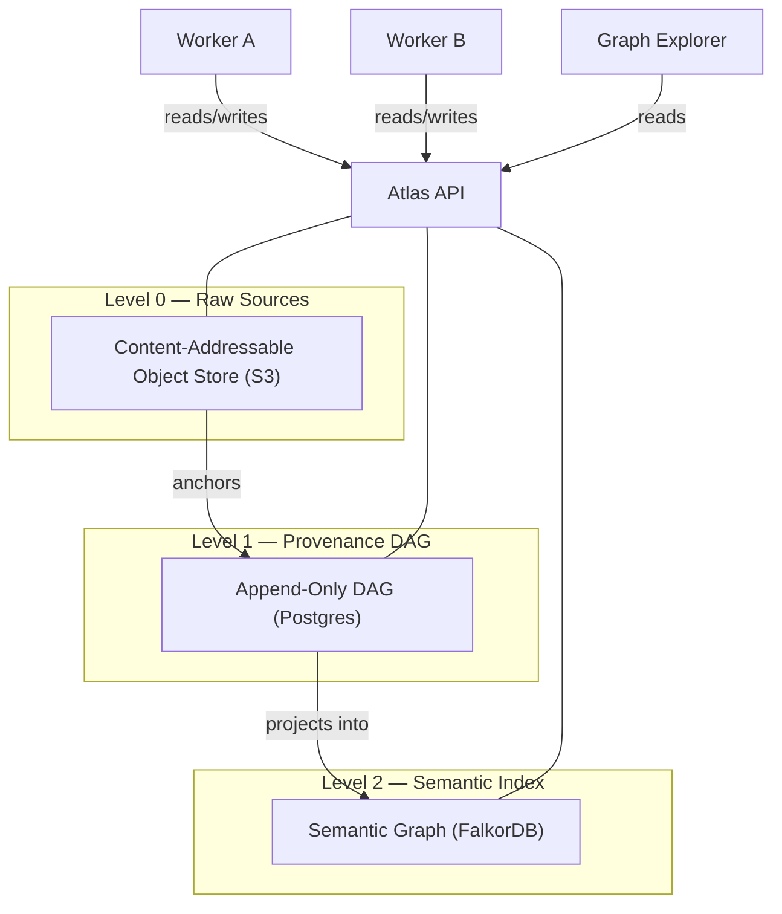

# Atlas: A Provenance Database for LLM Context Management

## Abstract

We present Atlas, a domain-specific database architecture for knowledge systems in which provenance is not metadata but the foundational data structure. Atlas inverts the conventional relationship between knowledge graphs and provenance: rather than attaching provenance information to an existing knowledge graph, the provenance DAG *is* the primary representation, and the semantic knowledge graph is a materialized view projected from it. The architecture comprises three storage levels — an immutable content-addressable object store for raw source artifacts, an append-only directed acyclic graph for derivation history, and a semantic graph index optimized for associative retrieval — unified behind a single API. All data, including metadata, classifications, and provenance itself, is treated as knowledge: queryable, derivable, and subject to the same immutability guarantees. We argue that this architecture is uniquely suited to the emerging regime of large-context-window language models, where accumulation of full inferential history provides a strategic advantage over systems that destructively consolidate.

The system is delivered as two components: **Atlas DB**, a self-contained server (Docker Compose stack) exposing the complete data model through a REST API, and **Atlas Explorer**, a bundled visual interface for navigating provenance chains and the semantic graph. Together they constitute a complete, deployable provenance database with an integrated research tool.

## 1. Introduction

Knowledge management systems face a fundamental tension: they must serve both *current* truth and *historical* understanding. Traditional knowledge graphs optimize for the former — they store what is believed to be true now, updated in place as understanding changes. This design made sense in an era of expensive storage and limited query capacity. It makes less sense in an era of large language models, where the ability to present a model with the full derivation history of a belief — including contradictions, revisions, and competing interpretations — produces qualitatively better reasoning than presenting a single consolidated snapshot.

Existing systems that address this tension do so partially. Temporal knowledge graphs (Graphiti/Zep) preserve *when* facts were valid but perform destructive entity summary updates, losing derivation history. Versioned knowledge bases (TerminusDB) track *what* changed across snapshots but not *why* or *how* knowledge was derived. Immutable databases (Datomic, Fluree) preserve all historical states but lack a semantic knowledge layer and do not model derivation chains. No existing system treats the full chain of provenance — from raw source artifact through extraction, normalization, and synthesis — as first-class, queryable knowledge.

Atlas addresses this gap through a structural inversion: the provenance DAG is the system, and everything else — including the semantic knowledge graph — is a view derived from it. This paper describes the architecture, its invariants, and its properties.

## 2. Architecture

Atlas is organized into three storage levels. Each level serves a distinct function, but they are not independent layers in a traditional stack — Level 1 carries Level 2, and Level 0 anchors Level 1. The three levels are implementation details behind a single API; external consumers interact with Atlas exclusively through this API.

### 2.1 Level 0: Raw Sources (Quellen)

Level 0 is an immutable, content-addressable object store. Every external artifact ingested into Atlas — a document, an email, a chat transcript, an image — is stored as a Record: a raw, unmodified copy of the original, addressed by its SHA-256 content hash. Records are self-describing through attached metadata sufficient to reconstruct the full database state from Level 0 alone.

Level 0 is the only level that contains ground truth in the absolute sense. It is the archive — the fixpoint against which all derived knowledge can be validated.

**Invariants:**
- Records are immutable. Once written, a Record is never modified or deleted.
- Records are content-addressed. The SHA-256 hash serves as the canonical identifier.
- Records are self-describing. Metadata is sufficient for full reconstruction.

### 2.2 Level 1: Provenance DAG (Provenienz)

Level 1 is an append-only directed acyclic graph stored in Postgres. Its nodes are Thoughts — knowledge products derived from Records or other Thoughts through processing by external tools (workers). Every Thought requires at least one input (a Record or another Thought) and one tool attribution. The graph is strictly acyclic because derivations cannot be circular: a Thought cannot be derived from its own output.

Level 1 is the core of Atlas. It stores the complete history of how knowledge was produced — not just what is believed, but *how it came to be believed*. This history is itself knowledge: queryable, traversable, and available as context for downstream consumers.

Provenance edges carry metadata: which tool produced the derivation, its configuration, the model version (if an LLM), and timestamps. This metadata is not auxiliary — it is part of the knowledge graph. A derivation produced by a 2024 language model and one produced by a 2028 model from the same source Record are both preserved as competing interpretations with full provenance.

**Invariants:**
- The graph is append-only. Thoughts are never modified or deleted.
- The graph is acyclic. No Thought can transitively depend on itself.
- Every Thought has provenance. No node exists without at least one input edge and one tool attribution.

### 2.3 Level 2: Semantic Index (Semantik)

Level 2 is a semantic graph stored in FalkorDB, optimized for associative traversal and retrieval. It is a **materialized view** projected from Level 1 — specifically, a filtered subset of DAG nodes (entities, facts, relations) represented as a property graph with semantic edges.

Every node and every edge in Level 2 has a provenance reference back into the Level 1 DAG. Level 2 contains no independent truth — it is entirely derived from and traceable to Level 1.

Relations in Level 2 are natural-language labels, not formal ontology predicates. Each relation is a unique node with its own identity, temporal validity window (`valid_from`, `valid_until`), confidence score, and provenance chain. The ontology is not predefined — it emerges from the data as workers extract and normalize relations over time.

Level 2 is, strictly speaking, an index. It exists because the full Level 1 DAG is too large and too deep for efficient associative retrieval. Consumers — whether LLM agents, dashboards, or analytical tools — typically enter through Level 2 and descend into Level 1 only when provenance or derivation history is needed.

**Invariants:**
- Every node and edge in Level 2 has a provenance reference to Level 1.
- Level 2 can be fully reconstructed from Level 1.
- Relations use natural-language labels. No formal ontology is required.

## 3. Core Properties

### 3.1 Everything Is Knowledge

Atlas makes no distinction between data, metadata, and provenance. A classification ("this Record belongs to the finance domain") is a Thought with provenance. A visibility decision ("this Record is accessible to group X") is a Thought with provenance. An assessment of quality ("the 2028 extractor produces better results than the 2024 extractor") is a Thought with provenance.

This principle — *everything is knowledge* — eliminates the need for separate metadata systems, tagging taxonomies, or access control lists as external infrastructure. All of these are expressible as nodes in the DAG, derived from the same sources, subject to the same immutability guarantees, and queryable through the same API.

### 3.2 Immutability and Accumulation

Atlas is strictly append-only at the knowledge level. No Record, Thought, or semantic relation is ever modified or deleted through normal operation. When new information contradicts existing knowledge, the contradiction is represented as a new Thought — not as an update to the old one. Both coexist in the graph, each with full provenance.

This design is a deliberate bet on the trajectory of language model context windows. Systems that destructively consolidate today — merging entity summaries, deduplicating facts, compacting histories — optimize for current retrieval efficiency at the cost of inferential depth. Atlas optimizes for a future in which a model receiving the full derivation history of a belief (including contradictions and revisions) produces better reasoning than one receiving a consolidated summary.

Immutability applies to knowledge, not to infrastructure. Technical defects (e.g., a buggy worker producing a million duplicate entries) are addressable through administrative purge operations that act on the storage level outside Atlas's data model, identified by worker run IDs. These operations are logged but are not part of the knowledge graph — they are infrastructure maintenance, not epistemological events.

### 3.3 The Provenance DAG as Substrate

In conventional systems, the knowledge graph is primary and provenance is attached to it as secondary metadata. Atlas inverts this relationship: the provenance DAG (Level 1) is the foundational structure, and the semantic knowledge graph (Level 2) is a projection from it.

This inversion has a concrete architectural consequence: operations that would require complex graph surgery in a conventional system become simple view operations in Atlas. Reprocessing sources with better tools produces new Thoughts alongside old ones — no migration required. Filtering out results from an obsolete worker is a query parameter, not a data operation. Evaluating competing interpretations of the same source is a traversal of the DAG, not a diff between snapshots.

### 3.4 Visibility as a Derived Property

Access control in Atlas is not a system feature but an application-level concern expressible within the data model. Every input artifact has an owner — not a person but a user group. Groups are hierarchically organized. A node in the DAG is visible to a user if and only if all of its inputs are visible to that user. At the root (Level 0), this means ownership by one of the user's groups.

Visibility propagates through the provenance graph: a Thought derived from one public and one confidential Record is automatically confidential. Changing visibility at a source Record propagates immediately through all derived Thoughts — not through explicit re-tagging but through DAG traversal. This is compliance by architecture, not by policy.

The classification of Records into visibility groups is itself a Thought with provenance — produced by a worker, subject to revision, queryable like any other knowledge.

## 4. Implementation

Atlas is delivered as two components.

### 4.1 Atlas DB

Atlas DB is a self-contained server deployed as a Docker Compose stack. It encapsulates the three storage engines (S3-compatible object store, Postgres, FalkorDB) behind a single REST API. The storage engines are hidden implementation details — consumers interact exclusively with the API, which enforces all invariants: immutability, acyclicity of the provenance DAG, mandatory provenance on every Thought, and content-addressability of Records.

The API is the sole interface to the system. There is no query language in the traditional sense — the API *is* the query language, imperative rather than declarative. All operations — ingesting Records, creating Thoughts, traversing provenance chains, querying the semantic graph — are API calls. Workers, the Explorer, and any future application consume the same interface.

### 4.2 Atlas Explorer

Atlas Explorer is a bundled visual interface for navigating and inspecting the Atlas data model. It is the first and reference application built against the Atlas API, shipped alongside Atlas DB but architecturally separate — it reads from the API like any other consumer.

The Explorer serves three purposes:

- **Provenance inspection.** Given any node in the semantic graph (Level 2), the Explorer traces its full derivation chain through the DAG (Level 1) down to the source artifacts (Level 0). This makes the "everything is knowledge" principle tangible: a user can follow any fact back to the raw source that produced it, through every intermediate processing step.
- **Graph exploration.** The semantic graph can be navigated visually — entities, relations, temporal validity, confidence scores. This provides the primary human interface to Atlas's knowledge state, since Level 2 is optimized for exactly this kind of associative traversal.
- **Architecture validation.** The Explorer demonstrates that the API is sufficient to support rich interactive applications. If the Explorer can render full provenance chains, temporal graphs, and cross-level traversals, then so can any downstream application — agent systems, dashboards, or export tools.

The Explorer is not part of Atlas's core architecture. It is an application. But it is bundled because a database without a way to see its contents is not usable as a research tool — and Atlas, in its current phase, is primarily a research tool.

## 5. Workers

Atlas is a database. It does not contain application logic, AI models, or processing pipelines. External processes — **workers** — interact with Atlas exclusively through the API, reading existing Records and Thoughts and writing new Thoughts.

Workers may be LLM-based (entity extraction, summarization, synthesis), deterministic (format conversion, deduplication detection), or hybrid. Atlas is agnostic to the nature of its workers — it tracks only the provenance of their outputs: what inputs they consumed, which tool and configuration they used, and when they ran. Workers are identified by run IDs, enabling administrative operations (such as purging defective runs) without affecting the knowledge model.

The same Record can be processed by multiple workers or by successive versions of the same worker. Old and new results coexist with full provenance. Consumers select between them through view configuration (e.g., preferring the most recent extractor), not through data operations.

The design, implementation, and evaluation of a concrete worker pipeline — from raw data ingestion through normalization, summarization, and entity extraction to a populated semantic graph — is the subject of a companion paper.

## 6. Related Work

### 6.1 Temporal Knowledge Graphs: Graphiti/Zep

Graphiti (Zep, 2024–2025) is the closest existing system to Atlas in the LLM context management space. It builds temporal, provenance-aware knowledge graphs using FalkorDB or Neo4j, with bidirectional episode indices and temporal validity windows. Facts are invalidated rather than deleted.

However, Graphiti performs destructive entity summary updates, lacks a separate content-addressable source archive (Level 0), embeds provenance in the knowledge graph rather than maintaining a separate provenance DAG, and does not treat provenance as queryable knowledge. Atlas can be understood as an extension of Graphiti's philosophy — adding immutability, a source archive, and the architectural inversion that makes provenance the substrate rather than an annotation.

### 6.2 Versioned Knowledge Bases: TerminusDB

TerminusDB provides Git-like versioning (branch, merge, time-travel) over an RDF knowledge graph using append-only delta encoding. It captures *what* changed across versions but not *why* — there is no derivation chain, no source archive, and no concept of workers as provenance-tracked processors. Its foundational structure is a versioned graph, not a provenance DAG.

### 6.3 Immutable Databases: Datomic and Fluree

Datomic (Hickey, 2012) operationalizes Pat Helland's "Immutability Changes Everything" thesis as an append-only database of immutable datoms. Fluree combines an append-only ledger with a semantic graph database. Both capture temporal history but not epistemic history — they record *when* facts changed but not *how knowledge was derived from sources through processing chains*.

### 6.4 W3C PROV-DM

The W3C PROV Data Model provides a formal vocabulary for provenance (Entity, Activity, Agent, wasGeneratedBy, wasDerivedFrom, used). Atlas's internal model is semantically compatible with PROV-DM — Records map to Entities, worker runs to Activities, tools to Agents — but Atlas does not depend on or implement the W3C stack (RDF, SPARQL, OWL). PROV-DM compatibility exists at the conceptual level, enabling potential export or interoperability without architectural coupling.

### 6.5 Nanopublications

Nanopublications (Kuhn & Dumontier, 2014) are immutable, content-addressable scholarly assertions with embedded provenance. They share Atlas's commitment to immutability and provenance-per-assertion but are a flat collection of independent assertions — they do not form a derivation DAG connecting assertions through chains of processing, and they do not support a semantic graph layer.

### 6.6 The Identified Gap

No existing system combines: (a) a content-addressable immutable source archive, (b) an append-only provenance DAG as the primary data structure, (c) a semantic knowledge graph as a materialized view with per-edge provenance, and (d) natural-language relations with emergent ontology. Each component has mature prior art; the architectural composition is novel.

## 7. Discussion

### 7.1 The Context Window Bet

Atlas's append-only accumulation model is predicated on a specific technological trajectory: that large language model context windows will become fast and cheap enough to consume full derivation histories. If this trajectory holds, systems that destructively consolidate today will be unable to reconstruct the inferential context that Atlas preserves. If it does not hold, Atlas pays a storage and retrieval cost for history that cannot be effectively utilized.

Current trends support the bet. Context windows have grown from 4K tokens (2022) to 200K+ tokens (2025), with costs per token declining by orders of magnitude. The architectural question is not whether models *can* process full provenance chains, but when they can do so at acceptable latency and cost for interactive use.

### 7.2 Reprocessing Without Migration

A distinctive property of Atlas's architecture is that improvements in processing tools require no data migration. When a better entity extractor becomes available in 2028, it runs over the same Level 0 Records and produces new Thoughts in Level 1. Old and new results coexist. Consumers select between them through view configuration — filtering by worker version, recency, or confidence score. The old results remain available as fallback, as training signal, or as historical context.

This property follows directly from immutability and the separation of Level 0 (sources) from Level 1 (derivations). In systems that update in place, reprocessing is a migration — destructive, irreversible, and operationally risky. In Atlas, reprocessing is an append operation.

### 7.3 Toward a CRDT-Compatible Architecture

An add-only monotonic DAG is provably a Conflict-Free Replicated Data Type (CRDT) — it can be replicated across distributed nodes and always merged into a consistent state without coordination. This property, while not exploited in the current single-node design, suggests that Atlas's architecture could natively support decentralized, coordination-free knowledge management. This connection between provenance DAGs and CRDTs appears unexplored in the literature.

## 8. Conclusion

Atlas proposes a structural inversion in knowledge system design: provenance as substrate rather than metadata, knowledge graph as view rather than source of truth. The architecture — immutable source archive, append-only provenance DAG, semantic graph as materialized view — is a composition of individually well-understood components whose integration has not been previously proposed.

The core thesis is that knowledge graph history is not metadata — it is knowledge. By treating all provenance, all classifications, all assessments as first-class nodes in the same graph, Atlas eliminates the distinction between data and metadata, between knowledge and knowledge-about-knowledge. Everything is knowledge. Everything is graph.

The system is designed for a technological regime that does not yet fully exist — one in which language models can efficiently consume full derivation histories. This is a deliberate architectural bet, analogous to developing a 3D game engine before consumer hardware can render it in real time. Systems that accumulate inferential history today will be positioned to provide qualitatively richer context to capable models tomorrow. Systems that destructively consolidate will not be able to reconstruct what they have discarded.

## References

- Helland, P. (2015). Immutability Changes Everything. CIDR 2015.
- Hickey, R. (2012). Datomic: A Database of Flexible, Time-Based Facts.
- Kuhn, T. & Dumontier, M. (2014). Trusty URIs: Verifiable, Immutable, and Permanent Digital Artifacts for Linked Data. ESWC 2014.
- Mendel-Gleason, G. et al. TerminusDB: An Open Source Model Driven Graph Database for Knowledge Graph Representation.
- Moreau, L. & Missier, P. (2013). PROV-DM: The PROV Data Model. W3C Recommendation.
- Nelson, T. (1965). A File Structure for the Complex, the Changing, and the Indeterminate. ACM/CSC-ER.
- Rasmussen, P. (2025). Zep: A Temporal Knowledge Graph Architecture for Agent Memory.
- Sikos, L.F. & Seneviratne, O. (2020). Provenance-Aware Knowledge Representation: A Survey. Data Science and Engineering.
- Takan, S. (2023). Knowledge Graph Augmentation: Consistency, Immutability, Reliability, and Context. PeerJ Computer Science.

---

*Draft v0.1 — April 2026*
