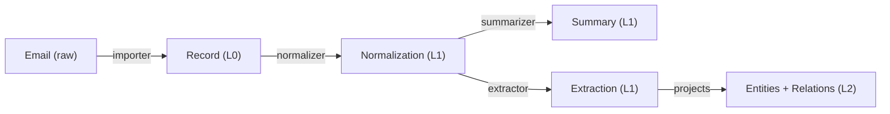

# Atlas Workers: Building a Semantic Graph from Raw Data

## Abstract

We demonstrate how a pipeline of independent workers — both mechanistic and LLM-assisted — transforms raw data into a provenance-complete semantic knowledge graph on the Atlas platform. Starting from unstructured inputs (email archives, chat transcripts), we trace the full path through ingestion, normalization, summarization, and entity extraction to a navigable semantic graph where every node and edge is traceable to its source. Workers are stateless processes that interact with Atlas exclusively through its API, identified by run IDs, producing append-only Thoughts with full provenance. The pipeline validates Atlas's core architectural claim: that Level 2 (semantic graph) is a materialized view of Level 1 (provenance DAG), grounded in Level 0 (raw sources).

## 1. Introduction

- Paper 1 defines the database; this paper fills it
- The challenge: from unstructured data to structured knowledge, with provenance at every step
- Why workers are not plugins or modules but independent processes against an API
- Goal: end-to-end demonstration with real data (email, chat exports)

## 2. Worker Architecture

### 2.1 Worker Anatomy

- Stateless: no internal memory between runs
- Identified by run ID (links all outputs of a single execution)
- Reads from API (Records, existing Thoughts), writes to API (new Thoughts)
- Tool and config metadata recorded on provenance edges
- DAG-query pattern: "find Records/Thoughts in state X without state Y"

### 2.2 Mechanistic vs. LLM-Assisted Workers

- Mechanistic: deterministic, reproducible (format conversion, deduplication, parsing)
- LLM-assisted: non-deterministic, contingent on model/prompt/version (summarization, extraction, classification)
- Atlas treats both identically — provenance tracks the difference
- Same Record processed by both: competing Thoughts coexist

### 2.3 Worker Orchestration

- No central orchestrator — workers discover work via DAG queries
- Self-healing: crashed workers leave incomplete chains, next run picks up
- Ordering via dependency: summarizer waits for normalizer output (implicit, not scheduled)

## 3. The Ingestion Pipeline

### 3.1 Importers (Level 0)

- **Email importer**: MBOX/EML → Records in S3, one per message, metadata (sender, date, subject) in frontmatter
- **Chat importer**: ChatGPT/Claude export → Records in S3, one per conversation
- Mechanistic workers — no LLM needed
- Content-addressed: duplicate detection via SHA-256

### 3.2 Normalizer (Level 0 → Level 1)

- Extracts clean text from format-specific containers (HTML email → plain text, JSON export → conversation text)
- Mechanistic worker
- Produces Thoughts of type "normalization" with provenance to source Record

### 3.3 Summarizer (Level 1 → Level 1)

- LLM-assisted: produces concise summary of normalized content
- Thought of type "summary" with provenance to normalization Thought
- Model version, prompt template recorded in provenance metadata
- Multiple summarizers can run over same input — results coexist

### 3.4 Entity Extractor (Level 1 → Level 1 + Level 2)

- LLM-assisted: identifies entities (people, projects, concepts, tools) and relations
- Produces Thoughts of type "extraction" in Level 1
- Projects entities and relations into Level 2 (FalkorDB)
- Natural-language relation labels, unique edge IDs, temporal validity, confidence scores
- Every Level 2 node and edge has provenance reference to Level 1 extraction Thought

### 3.5 The Full Chain

- Every arrow is a provenance edge with tool attribution
- Every node is immutable and append-only
- The Graph Explorer can trace any L2 entity back through this chain to the original email

## 4. Entity Resolution and Disambiguation

- Same person mentioned differently across sources ("F. Noël", "Florian", "flo@...")
- Alias resolution as a worker: produces "merge" Thoughts with confidence levels
- Not destructive — original extractions remain, merge is an overlay
- Context-dependent: "Atlas" the project vs. "Atlas" the mythological figure
- Uncertainty as first-class data: conviction scores on entity identity

## 5. Reprocessing

- New model available → run new extractor over existing Records
- Old and new extractions coexist in Level 1
- Level 2 view configurable: prefer latest worker, highest confidence, or specific version
- No migration, no data loss, no downtime
- Practical demonstration: same emails processed by two different LLMs, results compared in Explorer

## 6. Evaluation

- Dataset: [TBD — email archive, ChatGPT export]
- Metrics: provenance completeness (every L2 node traceable to L0), extraction quality, reprocessing overhead
- Qualitative: Explorer walkthrough of a single fact from L2 to L0

## 7. Discussion

- What the pipeline reveals about Atlas's architecture
- Worker failure modes and recovery
- Cost considerations: LLM calls per Record, storage growth
- Limits of current approach, open questions for future workers

## 8. Conclusion

- The semantic graph is not curated — it is grown
- Workers are the mechanism, provenance is the record
- Atlas DB + workers = a complete knowledge system, no manual curation required

## References

*TBD — will reference Paper 1 and relevant extraction/NLP literature*

---

*Skeleton v0.1 — April 2026*
